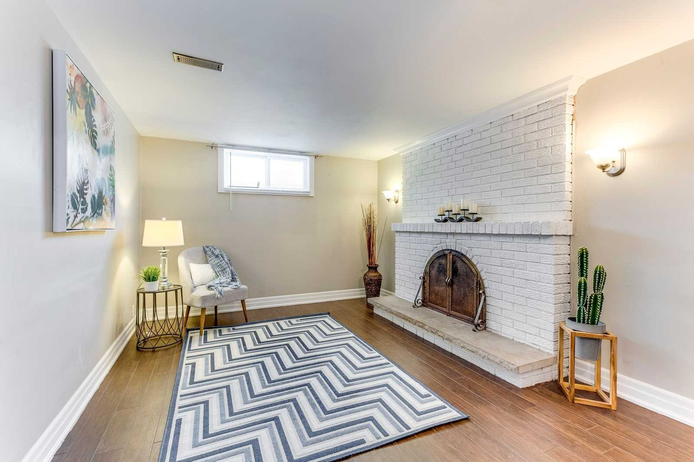
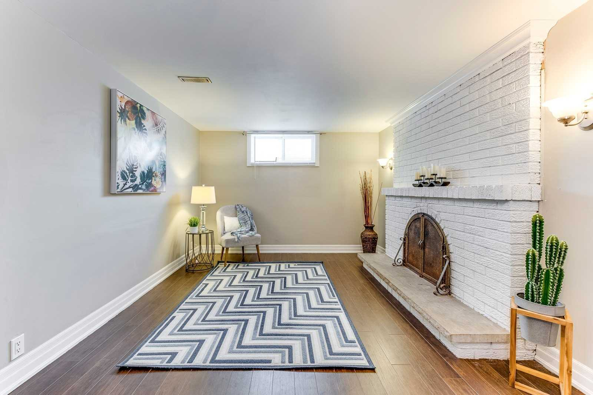
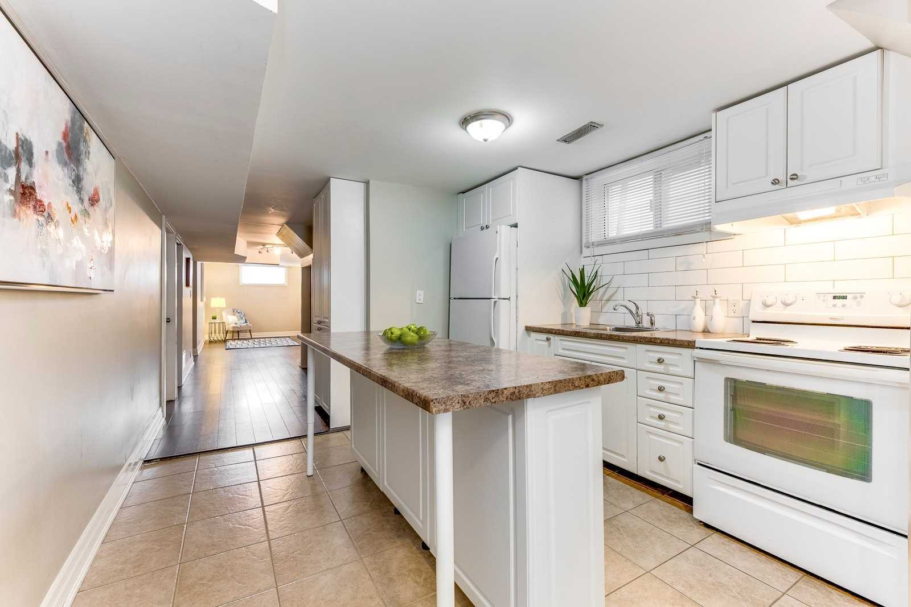
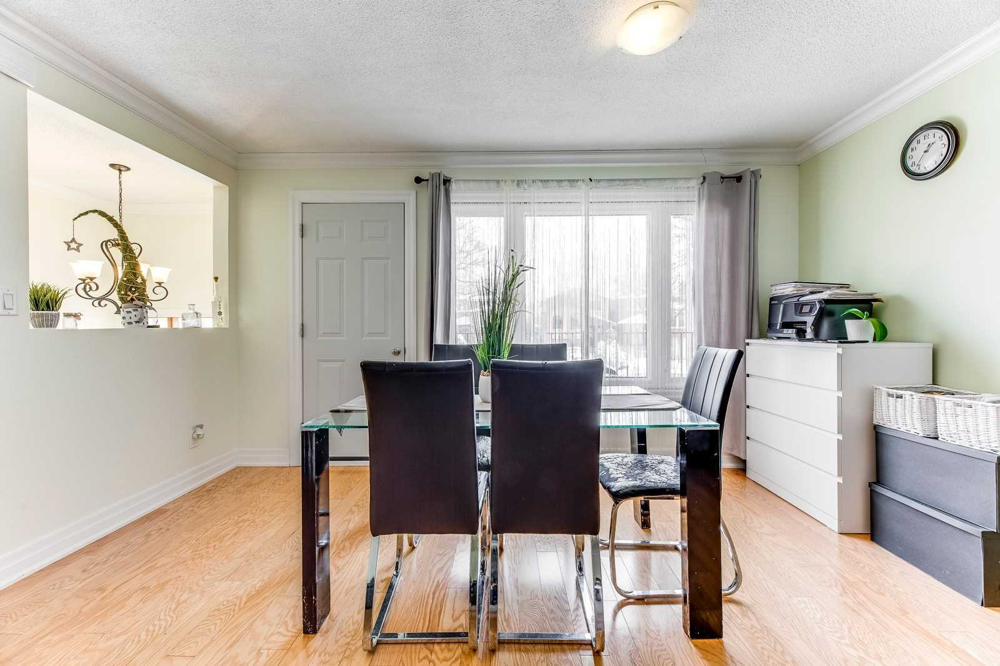
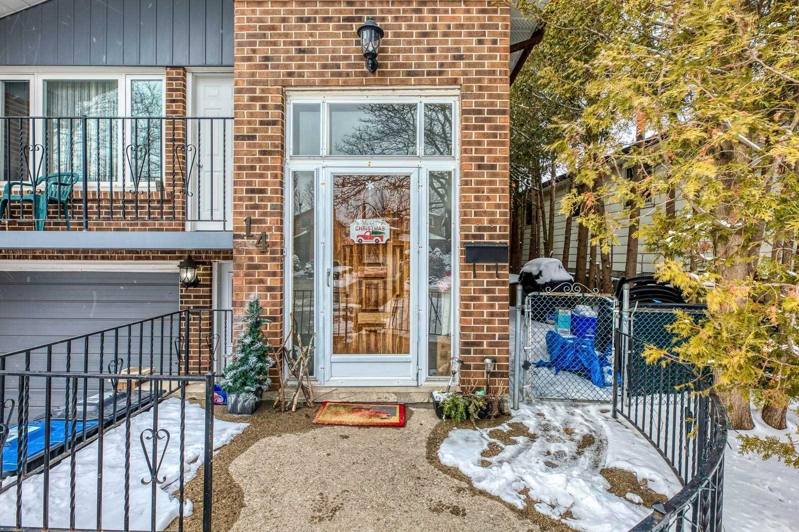
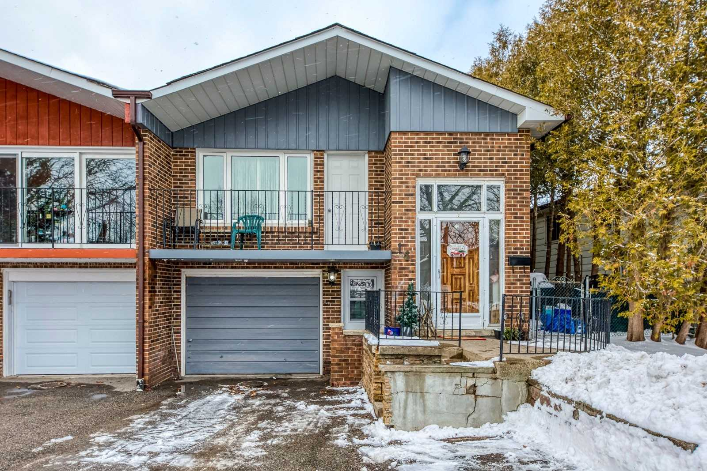
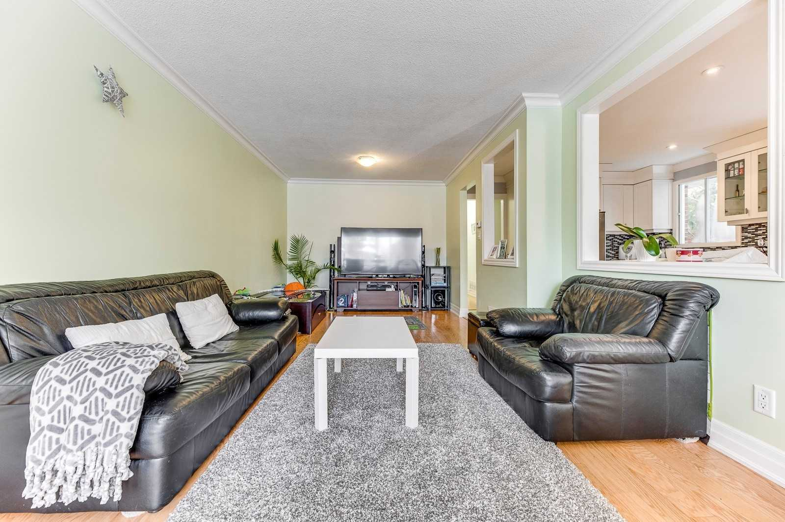
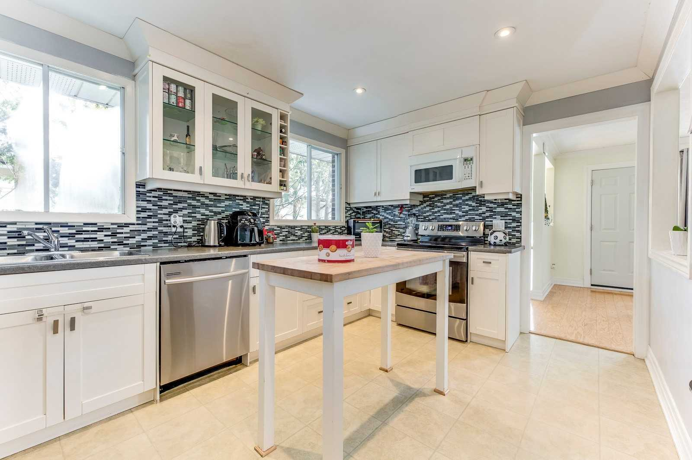
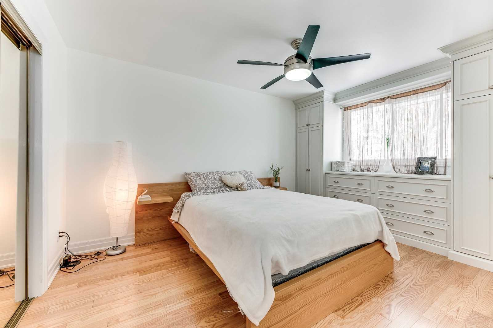

<!-- @import "[TOC]" {cmd="toc" depthFrom=1 depthTo=6 orderedList=false} -->

<!-- code_chunk_output -->

- [Building Information](#buildiing-information)
- [1. Pot Lights](#1-pot-lights)
- [2. Front Door](#2-front-door)
- [3. Front Stair Case](#3-front-stair-case)
- [4. Fireplace Removal in Basement](#4-fireplace-removal-in-basement)
- [5. Reinsulate the attic & Roof Fixes](#5-reinsulate-the-attic--roof-fixes)
- [6. Paint the foundation](#6-paint-the-foundation)
- [7. Replace A/C](#7-replace-ac)
- [8. Windows Replacement](#8-windows-replacement)
- [9. Removal of Built In Cabinets](#9-removal-of-built-in-cabinets)
- [10. Kitchen Renovations](#10-kitchen-renovations)
- [11. installation of Laundry Machine in Kitchen](#11-installation-of-laundry-machine-in-kitchen)
- [12. Garage: Prime & Paint Walls and Epoxy Floor](#12-garage-prime--paint-walls-and-epoxy-floor)
- [More Photos](#more-photos)

<!-- /code_chunk_output -->

## Buildiing Information
[Building Information](./BuildingInfo.pdf)

## 1. Pot Lights

Intall potlights throught the house including the 3 bedrooms, living room, basement. The kitchen already had potlights so maybe we can leave that along. One thing to note is: the master bedroom has a celing fan. Potentially that needs to be removed. See below

## 2. Front Door
<table>
  <tr>
    <td></td>
    <td> </td>
  </tr>
  <tr>
    <td align="center">Current</td>
    <td align="center">what I want</td>
  </tr>
</table>
 
Ideally do a double door. The size of our current door is 68" W by 80" H, which is about 2" narrower than the white one. Height is similar. I'm thinking a door like <a href="https://www.homedepot.ca/product/stanley-doors-67-in-x-82-375-in-x-4-5-8-in-seattle-zinc-full-lite-prefinished-white-left-hand-inswing-steel-prehung-double-door-with-astragal-and-brickmould/1000678858">this Stanley Door</a>

## 3. Front Stair Case
Change the front staircase to look nicer 
 
 

## 4. Fireplace Removal in Basement
Remove the fireplace. For the flooring, I know it needs to be placed and I know that we probably won't be able to find a exact match, but I think we can just find something that looks close since I'll eventually need to replace the flooring anyways.

 

## 5. Reinsulate the attic & Roof Fixes
Fix the below ceiling leaks. Also **estimate the cost of insulating the attic**
<table>
  <tr>
    <td></td>
    <td></td>
  </tr>
</table>

## 6. Paint the foundation
Can we also paint the foundation that is exposed
 

## 7. Replace A/C
 

## 8. Windows Replacement
**Kitchen Windows**
 

**Bedroom and Basement Windows**
 

**Small Bedroom Windows**
 

**Basement Side Windows**
<table>
  <tr>
    <td></td>
    <td></td>
    <td></td>
  </tr>
  <tr>
    <td align="center">Window 1</td>
    <td align="center">Window 2</td>
    <td align="center">Window 3</td>
  </tr>
</table>

## 9. Removal of Built In Cabinets
Remove built in cabinets

## 10. Kitchen Renovations
Replace countertop and floor of kitchen
 
 

## 11. installation of Laundry Machine in Kitchen
Install Laundry machine in the corner of the kitchen area
 

## 12. Garage: Prime & Paint Walls and Epoxy Floor
 

## More Photos

<table>
  <tr>
    <td align="center"></td>
  </tr>
  <tr>
    <td align="center">Utility Room</td>
  </tr>
</table>

<table>
  <tr>
    <td></td>
    <td></td>
    <td></td>
  </tr>
  <tr>
    <td align="center"><i>Basement Fireplace Straight View</i></td>
    <td align="center"><i>Basement Fireplace Angled View</i></td>
    <td align="center"><i>Basement Living Room</i></td>
  </tr>

  <tr>
    <td></td>
    <td></td>
    <td></td>
  </tr>
  <tr>
    <td align="center"><i>Basement Kitchen Area</i></td>
    <td align="center"><i>Kid's Bedroom</i></td>
    <td align="center"><i>Main Kitchen</i></td>
  </tr>

  <tr>
    <td></td>
    <td></td>
    <td></td>
  </tr>
  <tr>
    <td align="center"><i>Dining Room</i></td>
    <td align="center"><i>Front Door Entrance</i></td>
    <td align="center"><i>House Exterior Front View</i></td>
  </tr>
  <tr>
    <td></td>
    <td></td>
    <td></td>
  </tr>
  <tr>
    <td align="center"><i>Living Room</i></td>
    <td align="center"><i>Kitchen Alternate View</i></td>
    <td align="center"><i>Living Room Alternate View</i></td>
  </tr>
  <tr>
    <td></td>
    <td></td>
    <td></td>
  </tr>
  <tr>
    <td align="center"><i>Master Bedroom</i></td>
    <td align="center"></td>
    <td></td>
  </tr>
</table>

